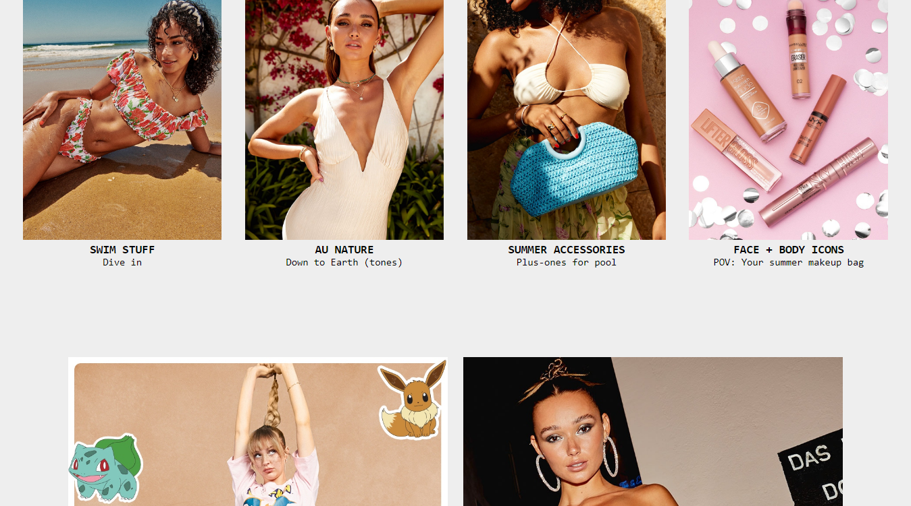

# Asos_Clone_Website

This project is a team project of 6 members, This is an e-commerce website that sells cosmetic products. We built this cloning project
Within 5 days and this is our first project during the Masai curriculum [Asos Website](https://lucent-custard-7305bd.netlify.app/){:target="_blank" rel="noopener"} .

## Features

- Login/signup
- productAdding to wishlist
- add cart
- filtering
- sorting
- payment checkout

## Installation

- copy this https://github.com/sunnylalwani41/Asos_Clone_Website.git
- Select path where you want to store the project in your pc
- open the corresponding file / folder with editor
- open terminal of your editor
- use  --> git clone (paste link) <-- 
- after project cloned to your folder
- go to index.html inside homenavbar folder
- open with live server
    
## Tech Stack

* Javascript
* HTML
* CSS

# Screenshots
## Landing Page

## Men Product Page

## Men Product Page

## Login/SignUp Page

